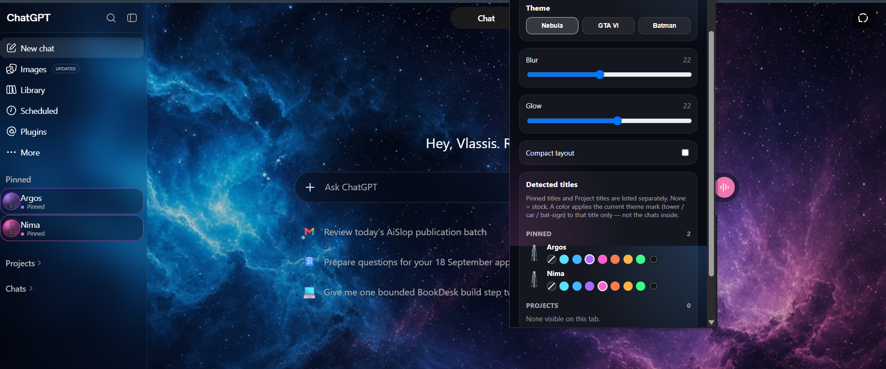
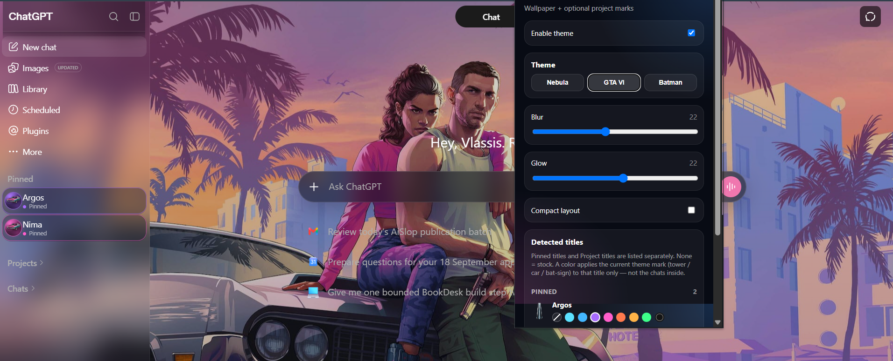
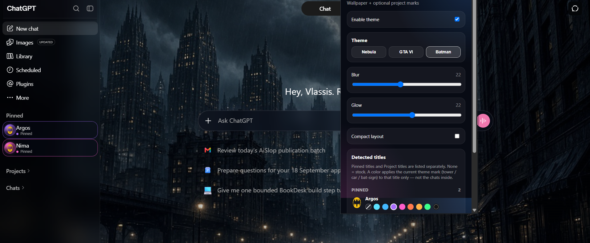

# GPT Theme

A Manifest V3 Chrome / Edge / Brave / Arc extension that skins [ChatGPT](https://chatgpt.com) with a wallpaper and optional title marks.

It does **not** rebuild ChatGPT. It does not change routing, message sending, or account data. It only injects CSS and a small content script.

This project was made **for fun**, with a large contribution from **Grok**. It is unofficial and not affiliated with OpenAI, Rockstar Games, or DC.

## Screenshots

### Nebula

### GTA VI

### Batman

## Features

- Three built-in themes: **Nebula**, **GTA VI**, **Batman**
- Wallpaper shows through the sidebar and main pane
- Marks **pinned titles** and **project titles** only (not chats inside them)
- Theme-specific marks: tower / car / bat-sign on a colored disc
- First load auto-assigns a color to every detected title (you can set **None** to leave one stock)
- Accents: cyan, blue, violet, magenta, ember, gold, green, black
- You can add your own themes (see below)

## Install

1. Download this repo or `GPT-Theme.zip`.
2. Unzip if needed. You need the folder that contains `manifest.json`.
3. Open `chrome://extensions` or `edge://extensions`.
4. Turn on **Developer mode**.
5. **Load unpacked** and select that folder.
6. Open ChatGPT and refresh.
7. Open the sidebar so **Pinned** and **Projects** are visible, then open the toolbar popup.

Reload the extension after each update, then hard-refresh the ChatGPT tab.

## Usage

1. Pick a theme in the popup (wallpaper + mark style).
2. Every pinned title and project title gets a mark and a color on first run.
3. Change a color, or choose **None** to keep that title stock.
4. Nested chats stay native.

## Add your own theme

1. Put a wide wallpaper in `assets/` (for example `wallpaper-ocean.jpg`).
2. Put a small transparent PNG mark in `assets/` (for example `mark-ocean.png`).
3. In `content/content.js` and `popup/popup.js`, add the theme key to `THEME_WALLPAPERS` / `THEME_MARKS`.
4. In `popup/popup.html`, add a button: `<button class="theme-card" data-theme="ocean">Ocean</button>`.
5. Reload the unpacked extension.

No backend is required.

## Permissions

| Permission | Why |
|---|---|
| `storage` | Save theme and per-title colors |
| Host access to `chatgpt.com` and `chat.openai.com` | Inject styles on ChatGPT only |

Nothing is sent to a third-party server by this extension.

## Limitations (it can be buggy)

ChatGPT’s DOM changes without notice. This extension uses headings and URL patterns, so it **will break sometimes**.

Known limits:

- Project / pinned detection can miss titles or pick up a nav row after a UI redesign
- Marks can drop after in-app navigation until the observer runs again
- Glass panels can fight ChatGPT’s own tokens (settings / profile menus are a common clash)
- GTA VI art is public marketing material and remains owned by Rockstar
- Batman mark is a fan-style icon for a personal theme, not an official product
- Not tested on every ChatGPT layout (narrow sidebar, mobile, Work vs Chat)

If it misbehaves: disable the extension, refresh, then reload unpacked.

## License

MIT. For fun. Use at your own risk.
